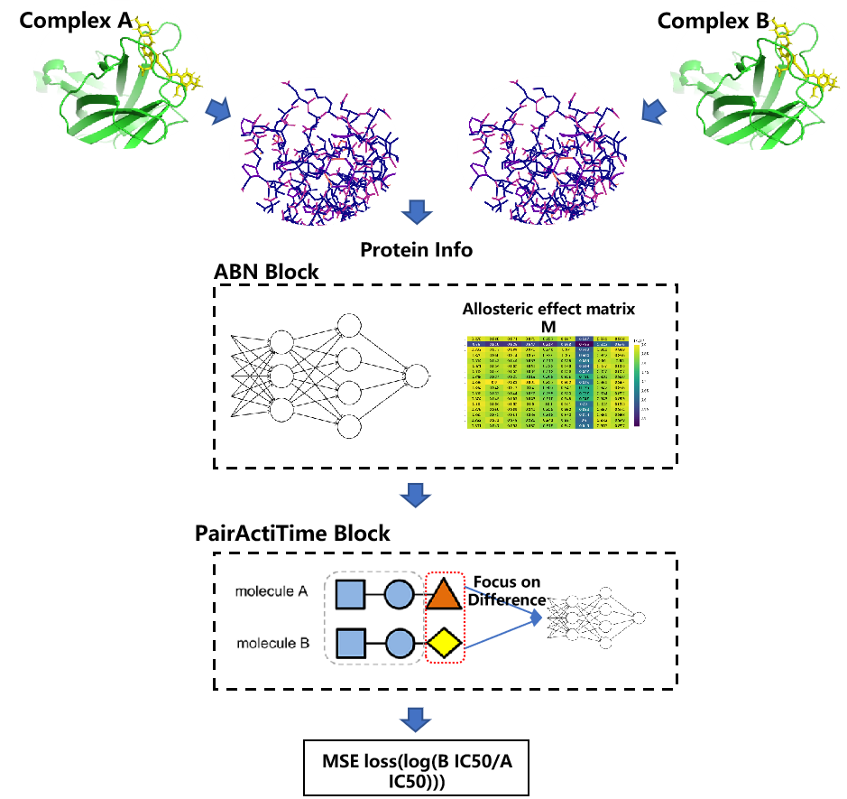
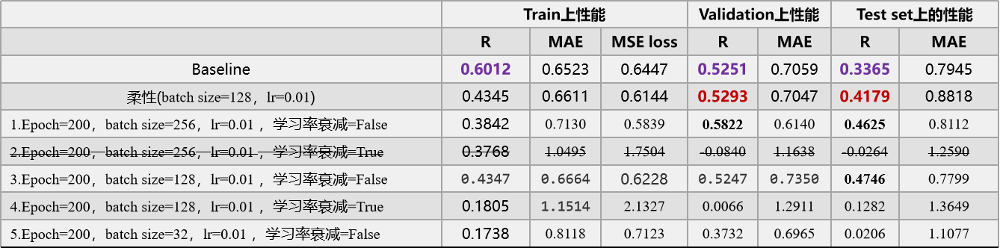
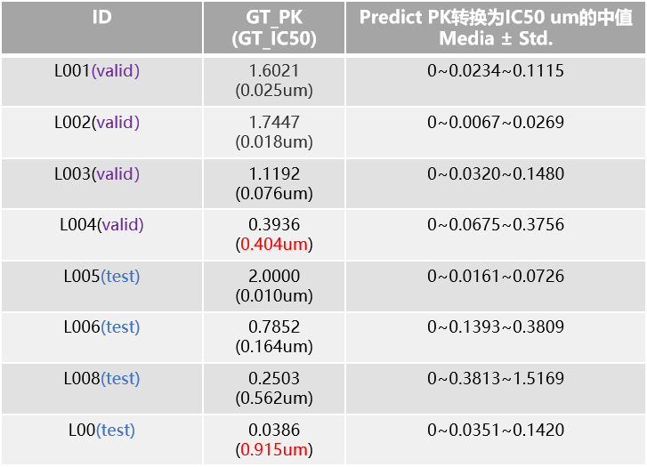

# PATNet
This project has realized the performance ranking of allosteric compound activities, and after training, the model can evaluate the activity of a series of new molecules, which is a series of methods of molecularbondnet

## Model architecture


## Model performance



## Project file organize  
```
- PAT_model/  
    - PDB-Pool/
    - inhouse_data/
    - inhouse_data_2/    
    - data_prepare.ipynb
    - Results_dir/
        - csv_dir/
            - molecule.xlsx
        - Results_inhouse_data/
        - Results_inhouse_data2/
    - result/
        - loss_log/
    - saved_model/
    - check_point/
    - debug/
    - log/
    - pred_csv/  
    - data_prepare.py
    - bond_net.py
    - utils.py
    - PATNet.py
    - simple_script.ipynb
- baseline/    
    - Glide/
    - IGN/
    - plotter.ipynb
```

## Usage
A briefly describe of how to use it.  
- **Step 1: Ligand Docking**
```python
Now me only know how to manually dock by schrodinger.
```
- **Step 2: Post-prepare docking results**
```python
python data_prepare.ipynb
```
- **Step 3: Use bagpage process complex as atom graph**
```python
python data_prepare.py
```
- **Step 4: Model train**
```python
python PATNet.py
```
- **Step 5: Model evaluate**
```python
python simple_script.ipynb
```

_More content updates will be uploaded after desensitization and other operations, please stay tuned, stay tuned..._